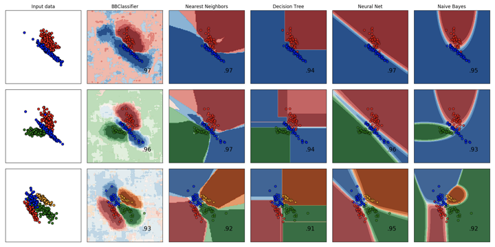

# BrainBlocks

The current release is **BrainBlocks 0.7.0**.


## Introduction

BrainBlocks is a framework developed by [The Aerospace Corporation](http://aerospace.org) for building scalable Machine Learning (ML) applications using principles derived from theories about the brain.  It leverages the properties of binary representations, vectors of 1s and 0s, to form a "cortial language" where hierarchies of blocks can share information with one another using a universal communication standard.  The design of BrainBlocks represents the practical experience gained from solving machine learning problems using a [Hierarchical Temporal Memory](https://numenta.com/assets/pdf/biological-and-machine-intelligence/BAMI-Complete.pdf) (HTM) like approach. 

BrainBlocks is a Python 3 library wrapped around a single-thread C++ backend.  Earlier versions were GPU or FPGA accelerated, and we plan to return parallelization to BrainBlocks.

BrainBlocks is designed to be:

- **Usable**: solve practical ML applications
- **Scalable**: quick and easy to build block hierarchies of any size
- **Extensible**: improve existing or develop entirely new blocks
- **Fast**: leverages low-level bitwise operations (Note: Python tools and templates may not currently be optimized yet)
- **Low Memory**: maintain as low memory footprint as possible
- **Lightweight**: small project size

Read our [extended documentation](docs/extended_readme.md) for further information about the what and why of BrainBlocks.

## Example Usage

Here is a simple example Python script of an anomaly detection BrainBlocks architecture that operates similar to HTM.  Other scripts may be found in the `examples/` directory.

```python
# Import blocks
from brainblocks.blocks import ScalarTransformer, SequenceLearner

# Setup data
values = [
    0.0, 0.0, 0.0, 0.0, 0.0, 1.0, 1.0, 1.0, 1.0, 1.0,
    0.0, 0.0, 0.0, 0.0, 0.0, 1.0, 1.0, 1.0, 1.0, 1.0,
    0.0, 0.0, 0.0, 0.0, 0.0, 1.0, 1.0, 0.2, 1.0, 1.0]
                                      # ^ anomalous dip of 0.2 here

# Setup blocks
st = ScalarTransformer(
    min_val=0.0, # minimum input value
    max_val=1.0, # maximum input value
    num_s=64,    # number of statelets
    num_as=8)    # number of active statelets

sl = SequenceLearner(
    num_spc=10,  # number of statelets per column
    num_dps=10,  # number of dendrites per statelet
    num_rpd=12,  # number of receptors per dendrite
    d_thresh=6,  # dendrite threshold
    perm_thr=20, # receptor permanence threshold
    perm_inc=2,  # receptor permanence increment
    perm_dec=1)  # receptor permanence decrement

# Connect blocks
sl.input.add_child(st.output) # connect sequence_learner input to scalar_transformer output

# Loop through data
for value in values:

    # Set scalar transformer value and compute
    st.set_value(value)
    st.feedforward()

    # Compute the sequence learner
    sl.feedforward(learn=True)

    # Get anomaly score
    scores.append(sl.get_anomaly_score())
```

## System Requirements

Tested Platforms:

- Windows (7/10)
- MacOS (10.14 or higher)
- Linux (Ubuntu 16+, CentOS 7+)

## Dependencies

Make sure you have the following dependencies installed on your system:

- git
- cmake
- C/C++ compiler (clang, visual studio C/C++, gcc/g++)
- python >= 3.6
- pip

## Installation

Cloning this repository:

```bash
$ git clone https://github.com/the-aerospace-corporation/brainblocks
$ cd brainblocks
```

Build and install python package from project directory:

```bash
$ python installer.py --install
```

Test Python installation (RECOMMENDED):

```bash
$ pytest test/
```

Build C++ unit tests (OPTIONAL):

```bash
$ python installer.py --cpptests
```

Clean the brainblocks project directory (OPTIONAL):

```bash
$ python installer.py --clean
```

Uninstall python package:
```bash
$ python installer.py --uninstall
```

## Running Examples

Run anomaly detection example:

```bash
$ python examples/python/anomaly_detection/multivariate_anomaly_detection.py
```


Run data classification example:

```bash
$ python examples/python/experiments/BBClassifier/run_classifier_comparison.py
```



## Project Layout

```bash
.
├── build                 # Temporary build workspace
├── docs                  # Documentation
├── examples              # Examples of BrainBlocks usage
│   └── python
│       └── experiments   # Work-in-progress scripts
├── src
│   ├── 3rdparty
│   │   └── pybind11      # Pybind11 dependency included in distro
│   ├── cpp               # Core C++ code
│   │   └── blocks        # Core C++ block algorithms
│   ├── python            # Python package code
│   │   ├── blocks        # Interface to block primitives
│   │   ├── datasets      # Dataset generation tools
│   │   ├── metrics       # Metrics for binary representations
│   │   ├── templates     # Common architecture templates
│   │   └── tools         # High-level package tools
│   └── wrappers          # C++ to other language wrappers
├── tests                 # Unit tests
│   ├── cpp
│   └── python
├── CMakeLists.txt        # CMake configuration
├── installer.py          # Build and installation script
├── LICENSE               # AGPLv3 license
├── README.md             # README file
├── requirements.txt      # Python dependencies
└── setup.py              # Python build file
```

## About Us


This projected was developed internally at [The Aerospace Corporation](http://aerospace.org) by:

- [Jacob Everist](https://github.com/jacobeverist)
- [David Di Giorgio](https://github.com/ddigiorg)

## License

This project is licensed under [AGPLv3](https://www.gnu.org/licenses/agpl-3.0.en.html).

© The Aerospace Corporation 2021
