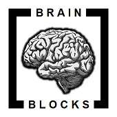
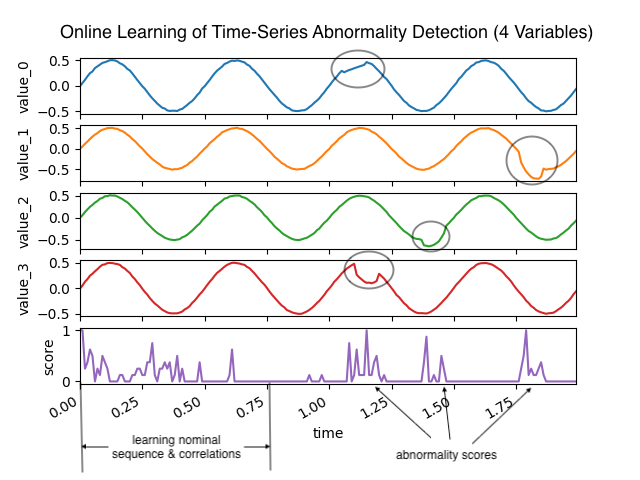

# BrainBlocks



## Introduction

BrainBlocks is a framework developed by [The Aerospace Corporation](http://aerospace.org) for building scalable Machine Learning (ML) applications using principles derived from computational neuroscience.  It models neuron activations with **binary patterns** (vectors of 1s and 0s) which form a kind of "cortical language".  Assemblages of computational **blocks** transmit these binary patterns between each other to create computational workflows that exploit these neuroscience principles.

BrainBlocks is a Python 3 library wrapped around a single-thread C++ backend.  The design of BrainBlocks represents the practical experience gained from solving machine learning problems using a [Hierarchical Temporal Memory](https://numenta.com/assets/pdf/biological-and-machine-intelligence/BAMI-Complete.pdf) (HTM) like approach. 

### Design

BrainBlocks is designed to be:

- **Usable**: solve practical ML applications
- **Scalable**: quick and easy to build block hierarchies of any size
- **Extensible**: improve existing or develop entirely new blocks
- **Fast**: leverages low-level bitwise operations
- **Low Memory**: maintain as low memory footprint as possible
- **Lightweight**: small project size

The current computational **blocks** provided are:
- **Transformers**: Encodes symbols, scalars, or vectors into binary patterns for processing by BrainBlocks.
- **PatternClassifier**: Supervised learning classifier for binary patterns.
- **PatternPooler**: Learns mapping from one representation to a pooled representation.
- **ContextLearner**: Learn inputs in provided contexts.  Flags anomaly if inputs are out-of-context.
- **SequenceLearner**: Learns input sequences.  Flags anomaly if previously unseen sequences are detected.  
    

### Theory

Further discussion on the theory of BrainBlocks can be found [here](docs/extended_readme.md).


### Machine Learning

#### [Multivariate Time-Series Anomaly Detection](examples/python/sequence_learner/multivariate_anomaly_detection.py)




#### [Comparison with Scikit-learn Classifiers](examples/python/experiments/BBClassifier/run_classifier_comparison.py)


## Getting Started

### System Requirements
BrainBlocks is known to run on the following platforms:

- Windows (7,8,10,11)
- MacOS (10.14 or higher)
- Linux (Ubuntu 16+, CentOS 7+)

To install and run, you need at least the following

- `python>=3.6`
- `pip`

If you want to develop BrainBlocks on your system, you need at least the following additional dependencies:
- `git`
- C/C++ compiler (`clang`, `visual studio`, `gcc`, etc.)

### Install
The easiest way to install BrainBlocks is using `pip`.

```bash
pip install brainblocks
```

### Run
Begin by running any of the examples found in the [examples](examples/python) directory.  Here we show converting scalar values into binary patterns using the `ScalarTransformer`.
```bash
python examples/python/transformers/scalar_transformer.py
```

An abridged version of the script is shown below:
```python
from brainblocks.blocks import ScalarTransformer

# Scalar value sequence
values = [0.0, 0.1, 0.2, 0.3, 0.4, 0.5, 0.6, 0.7, 0.8, 0.9, 1.0]

# Configure ScalarTransformer
st = ScalarTransformer(
    min_val=0.0, # minimum input value
    max_val=1.0, # maximum input value
    num_s=128,  # number of statelets
    num_as=16)  # number of active statelets

# Convert scalars to distributed binary representation
for i in range(len(values)):

    # Set scalar value and compute
    st.set_value(values[i])
    st.feedforward()
    
    # print scalar value and its binary representation
    print(values[i], st.output.bits)
```


## Development

### Build
Alternatively, you can build BrainBlocks on your system following these steps.

Clone the repository
```bash
git clone https://github.com/the-aerospace-corporation/brainblocks
```

Change to the project directory
```bash
cd brainblocks
```

Build and install 
```bash
pip install .
```

#### Build Alternatives

You can build the python packages separately and find them in `dist/` if the `build` package is installed in your environment.
```bash
pip install build
python -m build 
```

We also provide a helper script to build and reinstall BrainBlocks if you are making changes to the core code and want to experiment.  This will clean up previous BrainBlocks installations and install fresh from the local code.
```bash
python helper.py --install
```

### Tests
Run Python unit tests:
```bash
pytest
```

Build core C++ unit tests
```bash
python helper.py --cpptests
cd build/tests/cpp
ls test_*
```

### More Helper Script Options
Clean project directory of build artifacts:

```bash
python helper.py --clean
```

Python unit tests
```bash
python helper.py --test
```

Uninstall from Python environment
```bash
python helper.py --uninstall
```

Just build Python packages
```bash
python helper.py --build
```

## Project Layout

```bash
.
├── .github                  # Workflow scripts for build, testing, and packaging
├── build                    # Temporary build workspace
├── dist                     # Temporary location of built python packages
├── docs                     # Extra Documentation
├── examples                 # Examples of BrainBlocks usage
│   └── python
│       └── classification   # PatternClassifier examples
│       └── context_learner  # ContextLearner examples
│       └── pooling          # PatternPooler example
│       └── experiments      # Experiments and visualizations
│       └── sequence_learner # SequenceLearner examples
│       └── transformers     # Transformer examples
├── src
│   ├── cpp               # Core C++ code
│   │   └── blocks        # Core C++ block algorithms
│   ├── python            # Python package code
│   │   ├── blocks        # Interface to block primitives
│   │   ├── datasets      # Dataset generation tools
│   │   ├── metrics       # Metrics for binary representations
│   │   ├── templates     # Common architecture templates
│   │   └── tools         # High-level package tools
│   └── wrappers          # Python bindings
├── tests                 # Unit tests
│   ├── cpp               # C++ core unit tests
│   └── python            # Python nit tests
├── .gitignore            # files to exclude from version control
├── CMakeLists.txt        # CMake configuration for core C++ build
├── helper.py             # Helper script
├── LICENSE               # AGPLv3 license
├── MANIFEST.in           # Manifest file for python package
├── pyproject.toml        # Modern build system configuration file
├── README.md             # README file
└── setup.cfg             # setuptools config values
└── setup.py              # setuptools build script
```

## About Us


This projected was developed internally at [The Aerospace Corporation](http://aerospace.org) by:

- [Jacob Everist](https://github.com/jacobeverist)
- [David Di Giorgio](https://github.com/ddigiorg)


## License

This project is licensed under [AGPLv3](https://www.gnu.org/licenses/agpl-3.0.en.html).

© The Aerospace Corporation 2022
